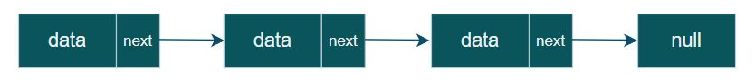
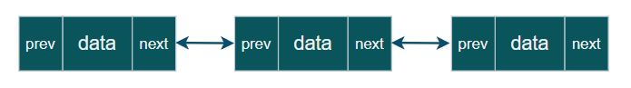
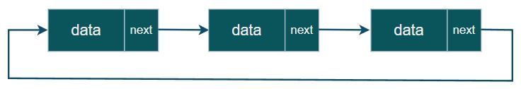
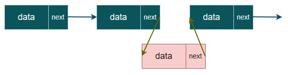
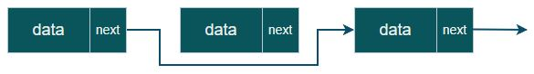

[기초 강의](https://swexpertacademy.com/main/learn/course/subjectDetail.do?courseId=CONTENTS_REVIEW&subjectId=AYVXaMEKQSIDFARs)

연결 리스트
===
Linked List 개념 설명 및 종류
---

- 데이터가 자료의 주소 값으로 서로 연결(Link)되어 있는 구조
- **단순 연결 리스트(Singly Linked-list)**, **이중 연결 리스트(Doubly Linked-list)**, **원형 연결 리스트(Circular Linked-list)** 등의 구조가 있다.
- Array와 비교 및 계산 복잡도   

||Array|Linked List|
|:--:|--|--|
|**장점**|무작위 접근 가능|빠른 자료 삽입, 삭제 자유로운 크기 조절|
|**단점**|느린 자료 삽입, 삭제 크기 조절 불가능|순차 접근만 가능 메모리 추가 할당|

|Operation|Time complexity|
|--|--|
|**Access i-th element**|O(N)|
|**Insert element at here**|O(1)|
|**Delete element**|O(N)(search time)|

### 1. 단순 연결 리스트(Singly Linked List)
- 각 노드에서 단방향으로 연결되는 리스트
- 후행 노드는 쉽게 접근 가능하지만, 선행 노드는 접근이 복잡한 단점 존재

### 2. 이중 연결 리스트(Doubly Linked List)
- 각 노드에서 양방향(선행, 후행)으로 연결되는 리스트
- 양 방향 접근이 용이하지만, 메모리를 추가적으로 사용

### 3. 원형 연결 리스트(Circular Linked List)
- 각 노드에서 단방향으로 진행되는 리스트
- 한 노드에서 모든 노드로 접근이 가능

Linked List의 동작
---
### 데이터 삽입

### 데이터 삭제

