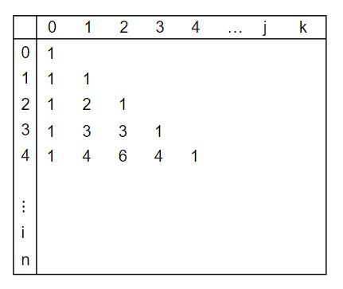

DP(Dynamic Programming)
===

- 그리디 알고리즘과 같이 <U>최적화 문제</U>를 해결하는 알고리즘
- Recursive + Memoization
- 점화식으로 표현 가능
- 먼저 작은 부분 문제들의 해를 구하고 이들을 이용하여 보다 큰 크기의 부분 문제들을 해결하여, 최종적으로 원래 주어진 문제를 해결하는 알고리즘

> 최적화 문제: 최적(최대값 이나 최소값 같은)값을 구하는 문제

대표 문제1
---

### 토끼 수 구하기
**조건**
- 첫 달에는 새로 태어난 토끼 한 쌍만이 존재한다.
- 두 달 이상이 된 토끼는 번식 가능하다.
- 번식 가능한 토끼 한 쌍은 매달 한 쌍을 낳는다.
- 토끼는 죽지 않는다.

**풀이**
- n번째 달에 a쌍의 토끼가 있었고
- 다음 n + 1 번째 달에는 새로 태어난 토끼를 포함해 b쌍이 있었다고 하자.
- 그러면 그 다음 n + 2 번째 달에는 a + b쌍의 토끼가 있게 된다.
- 이는 n번째 달에 살아있던 토끼는 새끼를 낳을 수 있지만, 바로 전달인 n + 1번째에 막 태어난 토끼는 아직 새끼를 낳을 수 없기 때문이다.
```
f(n)을 n번째 달에 토끼 수라고 하면,
f(n + 2) = f(n) + f(n + 1) 이 성립한다.
피보나치 수열
```

**재귀함수 구현**
```cpp
fibo(n) {
    if (n < 2) return n
    return fibo(n - 1) + fibo(n - 2);
}
```
- 재귀로 풀이가 가능하다.
- 하지만 n의 수가 커질 수록 중복호출이 많아진다.


수학적 귀납법
---

- 어떤 등식이 모든 n에 대해서 성립함을 보이기 위해서, 가능한 모든 n을 등식에 대입하여 증명할 수 는 없다.
- 주어진 등식이 n = 1일 때 성립함을 증명하고, n일 때 성립한다고 가정한 후, n + 1일 때 성립함을 증명한다.

### 증명 과정
    1. 귀납 기본(Induction base): n = 1 (혹은 n = 0)에 대해 등식이 성립함을 증명
    2. 귀납 가정(Induction hypothesis): 임의의 n에 대해 등식이 성립한다고 가정
    3. 귀납 단계(Induction step): 등식이 n + 1에 대해서도 성립함을 증명

### fibo(n)함수 호출 횟수 계산

- T(n) = fibo(n)을 계산하기 위하여 fibo() 함수를 호출하는 횟수
- T(n)은 재귀 트리 상의 마디의 수

<pre>
<code>조건: n >= 2, T(n - 1) > T(n - 2)
T(0) = 1;
T(1) = 1;
T(n) = T(n - 1) + T(n - 2) + 1
     > 2 * T(n - 2)
     > 2<sup>2</sup> * T(n - 4)
     > 2<sup>3</sup> * T(n - 6)
     ...
     > 2<sup>n/2</sup> * T(0) = 2<sup>n/2</sup></code>
</pre>

정리: 재귀적 알고리즘으로 구성한 재귀 트리의 마디 수를 n이라 하면, n >= 2인 모든 n에 대하여 T(n) > 2<sup>n/2</sup>이다.

증명: n에 대한 수학적 귀납법으로 증명
- **Induction base**:
>T(2) = T(1) + T(0) + 1 = 3 > 2 = 2<sup>2/2</sup>   
T(3) = T(2) + T(1) + 1 = 5 > 2.83 $\approx$ 2<sup>3/2</sup>

- **Induction hypothesis**:
> 2 <= m < n인 모든 m에 대해서 T(m) > 2<sup>m/2</sup>이라 가정

- **Induction step**:
> T(n) = T(n - 1) + (n - 2) + 1   
\> 2<sup>(n-1)/2</sup> + 2<sup>(n-2)/2</sup> + 1   
\> 2<sup>(n-2)/2</sup> + 2<sup>(n-2)/2</sup>   
= 2 * 2<sup>(n/2)-1</sup>   
= 2<sup>n/2</sup>

비둘기 집 원리
---

n + 1개의 물건을 n개의 상자에 넣을 때 적어도 어느 한 상자에는 두 개 이상의 물건이 들어있다는 원리

### 귀류법 증명
- 우리가 가정한 것에 역에 대해서 사실이라고 가정
- 그것이 모순됨을 증명하여 우리의 가정이 사실임을 증명
- n개의 비둘기 집과 n + 1마리의 비둘기가 있다고 가정
- 만약 각 비둘기 집에 한 마리 이하의 비둘기만 들어 있다면, 전체 비둘기 집에는 많아야 n마리의 비둘기가 존재
- 그런데 비둘기는 모두 n + 1마리이므로, 이것은 모순이다. 따라서 어느 비둘기 집에는 두 마리 이상의 비둘기가 있다.

### 피보나치 수열의 중복
- n번째의 피보나치수를 구하기 위해 알아야 할 값
  - fibo(0) ~ fibo(n - 1)
  - 즉, fibo()함수를 n번 호출하여 값을 알면 구할 수 있다.
- 재귀로 n번째의 피보나치수를 구할 경우 fibo(n)함수를 호출하게 되면
  - fibo()함수를 2^(n/2)번 이상 호출하게 된다.
  - 2^(n/2) > n
- 따라서 비둘기 집의 원리를 적용하면 중복해서 호출하고 있음을 알 수 있다.

메모이제이션(Memoization)
---

- 컴퓨터 프로그램을 실행할 때 이전에 계산한 값을 메모리 테이블에 저장 한 후 같은 문제가 반복적으로 필요할 시 이전에 계산한 값을 참조하여 불필요한 반복계산을 줄여주는 기술
- 동적계획법의 핵심이 되는 기술
- 추가적인 메모리 공간 필요
- 재귀함수 호출로 인한 시스템 호출 스택을 사용하게 되고 실행 속도 저하 또는 오버플로우가 발생할 수 있다.

### 피보나치 메모이제이션 코드
```cpp
// 실행 시간 O(n)
fibo(n) {
	if (n > 2 && memo[n] == -1)
		memo[n] = fibo(n - 1) + fibo(n - 2);
	return memo[n];
}
```

대표 문제2
---

### 페인트 칠하기

아파트를 각 층별로 파란색 또는 노란색 페인트로 칠한다

**조건**
- 노란색은 인접한 두 층에 연속하여 사용 가능
- 파란색은 인접한 두 층에 연속하여 사용 불가

이와 같은 규칙으로 N층의 아파트를 칠할 수 있는 방법의 수를 f(n)이라 하면, f(1) = 2, f(2) = 3이다. f(n)은?

**추론**
- 현재 층을 파란색으로 칠하면 이전 층이 꼭 노란색이어야 한다.
- 노란색의 경우, 이전 층이 파란색 + 노란색인 경우 모두 가능하다.
- 파란색의 경우, 이전 층이 노란색인 경우에만 가능하다.

**결론**
- yellow[n] = yellow[n - 1] + blue[n - 1]
- blue[n] = yellow[n - 1]
- f(n) = yellow[n] + blue[n]
- 단, yellow[1] = 1, blue[1] = 1이다.

**코드**
```cpp
dp[1][0] = dp[1][1] = 1;

for (int i = 2; i <=n; i++)
{
	dp[i][0] = dp[i - 1][0] + dp[i - 1][1]; // 노랑
	dp[i][1] = dp[i - 1][0];    // 파랑
}

printf("%d", dp[n][0] + dp[n][1]);
```

DP의 적용 조건
--- 

- 최적 부분문제 구조(Optimal substructure)
- 중복 부분문제 구조(Overlapping subproblems)

### 최적 부분문제 구조(Optimal substructure)
- 동적 계획법이 최적화에 대한 어느 문제에나 적용될 수 있는것은 아니다.
- 주어진 문제가 최적화의 원칙(Principle of Optimality)을 만족해야만 효율적으로 적용 가능
- 최적화의 원칙이란 어떤 문제에 대한 해가 최적일 때 그 해를 구성하는 작은 문제들의 해 역시 최적이어야 한다는 것
- 만약 큰 문제의 최적해가 작은 문제들의 최적화의 해들로 구성되지 않는다면 이 문제는 동적 계획법을 적용할 수 없다.

### 중복 부분문제 구조(Overlapping subproblems)
- DP는 큰 문제를 이루는 작은 문제들을 먼저 해결하고 작은 문제들의 최적 해(Optimal Solution)를 이용하여 순환적으로 큰 문제를 해결한다.
> 순환적인 관계(recurrence relation)를 명시적으로 표현하기 위해서 수학적 도구인 점화식을 사용
- DP는 문제의 순환적인 성질 때문에 이전에 계산되어졌던 작은 문제의 해가 다른 어딘가에 필요하게 되는데(Overlapping subproblems)이를 위해서 작은 문제들의 해를 어떤 저장공간(table)에 저장한다.
- 저장된 해들이 다시 필요할 때 마다 해를 얻기 위해 다시 문제를 재계산하지 않고 table의 참조를 통해 중복된 계산을 피하게 된다.

3단계 DP 적용 접근 방법
---

1. **최적해 구조의 특성을 파악하라**
    - 문제를 부분 문제로 나눈다
2. **최적해의 값을 재귀적으로 정의하라**
    - 부분 문제의 최적해 값에 기반하여 문제의 최적해 값을 정의한다.
3. **상향식 방법으로 최적해의 값을 계산하라**
    - 가장 작은 부분 문제부터 해를 구한 뒤 테이블에 저장한다.
    - 테이블에 저장되어 있는 부분 문제의 해를 이용하여 점차적으로 상위부분 문제의 최적해를 구한다.

피보나치 수 DP 적용
---

피보나치 수는 부분 문제의 답으로부터 본 문제의 답을 얻을 수 있으므로 최적 부분 구조로 이루어져 있다.
1. 문제를 부분 문제로 분할한다.
2. 점화식으로 정의한다.
3.  가장 작은 부분 문제부터 해를 구한다. 그 결과는 테이블에 저장하고 테이블에 저장된 부분 문제의 해를 이용하여 상위 문제의 해를 구한다.

### 코드
```cpp
fibo_dp(int n) {
    dp[0] = 0;
    dp[1] = 1;
    for (int i = 2; i <= n; i++)
        dp[i] = dp[i - 1] + dp[i - 2];
    return dp[n];
}
```

이항계수
---

### 재귀호출을 이용한 이항 계수의 계산
```
bino(n, k)
    IF k = 0 OR n = k
        RETURN 1
    ELSE
        RETURN bino(n - 1, k - 1) + bino(n - 1, k)
```

### 재귀 dp를 이용한 이항 계수의 계산
```
B[][] <- {-1}
bino(n, r)
    IF r = 0 OR n = r : RETURN 1
    IF B[n][r] != -1
        RETURN B[n][r]
    B[n][r] <- bino(n - 1, r - 1) + bino(n - 1, r)
    RETURN B[n][r]
```

### 반복 dp로 이항계수 계산
```
bino(n, k)
    B[][]
    FOR i in 0 -> n
        for j in 0 -> minimum(i, k)
            IF j = 0 OR j = i
                B[i][j] <- 1
            ELSE
                B[i][j] <- B[i - 1][j - 1] + B[i - 1][j]
    RETURN B[n][k]
```

### 메모리 저장 형태
- 파스칼 삼각형   


고난도 문제
---

